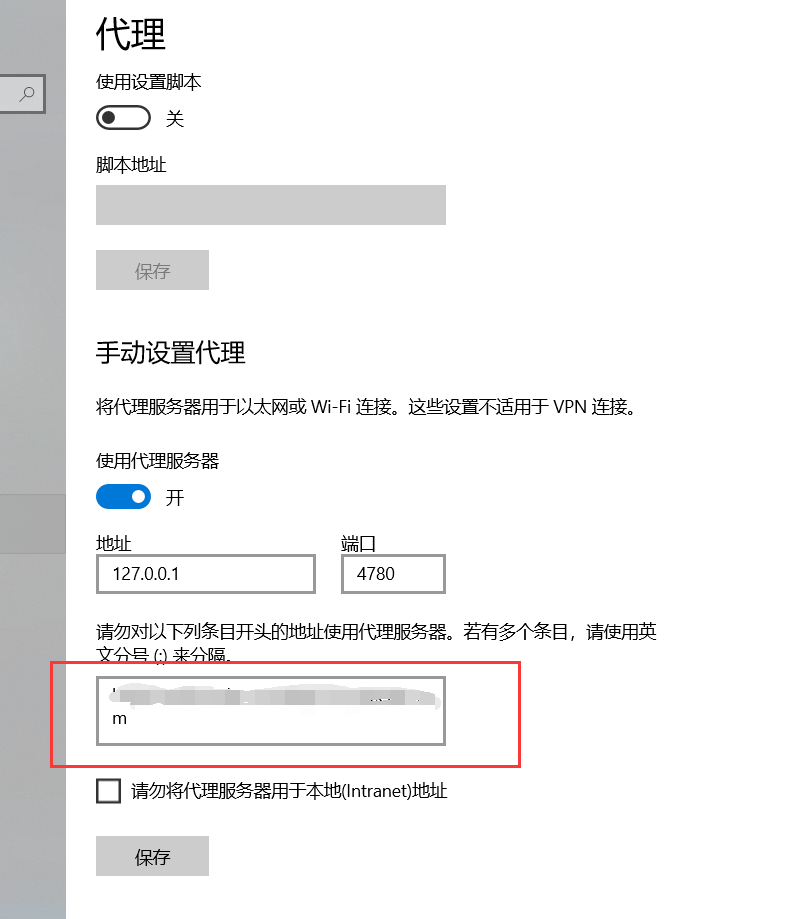

# NoProxyPython
使用代理时，设置windows对某些域名不使用代理

有时候在做开发时，可能会在hosts文件中设置访问某些域名时，访问本机，但是由于开了代理，会使hosts配置不启作用。这里就需要在“网络和Internet-->代理”中设置（文字太多不想打，直接看图吧）


# 使用方法
1.复制dist文件夹到你的硬盘中

2.在dist/index/config.txt中写入你要不使用代理的域名。格式为每行一个，如：

```
http://www.baidu.com
http://my.domain.com
```
3.双击dist/index/index.exe就行了

# 重新编译
先删除_pycache_、build、dist、index.spec文件夹和文件，然后修改源码（index.py）编译，编译完成后再在dist/index中添加一个config.txt，其中写入你要屏蔽的域名